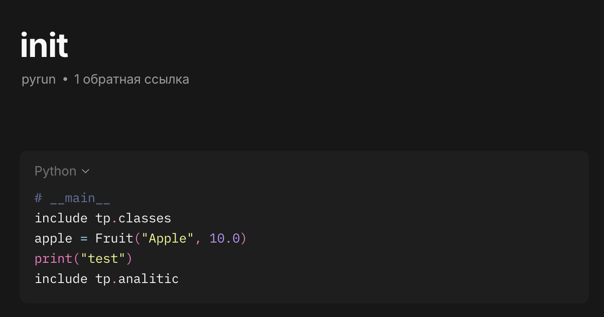
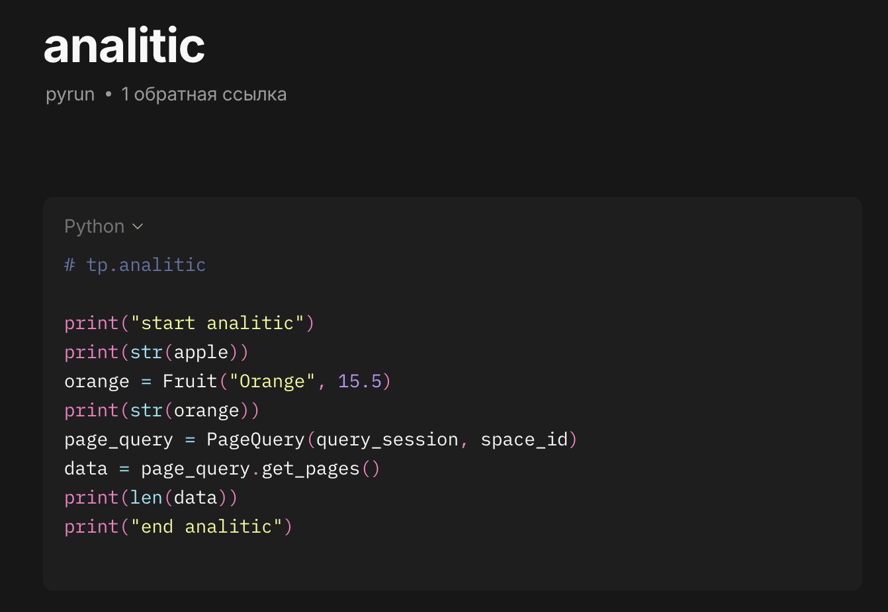
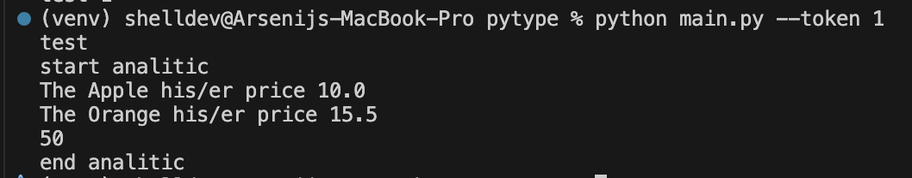

# PyType - Автоматизация заметок в Anytype  
  
PyType - это инструмент для выполнения Python скриптов, хранящихся в заметках Anytype. Проект позволяет создавать исполняемые скрипты прямо в вашем пространстве знаний Anytype и запускать их через Local API.  
  
## Возможности  
  
- 🐍 Выполнение Python кода из заметок Anytype  
- 🔗 Система модулей с поддержкой `include` для связывания скриптов  
- 🏠 Автоматический выбор рабочего пространства  
- 🔐 Безопасное хранение API токенов  
- 📦 Песочница для изолированного выполнения кода  
  
## Требования  
  
- Python 3.8+  
- Anytype с включенным Local API  
- Доступ к Local API Anytype (обычно `http://127.0.0.1:31009`)  
  
## Установка  
  
1. **Клонируйте репозиторий**  
```bash  
git clone https://github.com/she1kopr9d/Pytype.git  
cd Pytype
```

2. **Создайте виртуальное окружение**
```bash
python -m venv venv
```

3. **Активируйте виртуальное окружение**
На Linux/macOS:

```bash
source venv/bin/activate
```

На Windows:

```bash
venv\Scripts\activate
```

4. **Установите зависимости (если есть requirements.txt)**
```bash
pip install -r requirements.txt
```

## Использование

### Базовый запуск
```bash
python main.py
```

При первом запуске вам потребуется:

1. Ввести API-ключ из Local API Anytype
2. Выбрать рабочее пространство


### Быстрый запуск с сохраненным токеном**

```bash
python main.py --token <номер-пространства>
```

## Настройка Anytype
1. Включите Local API в настройках Anytype
2. Создайте объекты типа "pyrun" в вашем пространстве
3. Добавьте Python код в markdown блоки внутри этих объектов
4. Используйте # script_name в начале кода для именования скриптов
## Система модулей
PyType поддерживает простую систему модулей:

**Пример использования**

1. Скрипт начала (все скрипты начала должны называться __main__)


2. Скрипт, который показывает работу include/ classes


3. Скрипт, в котором испльзуется класс из classes и переменные из __main__


4. Вывод в консоле


Pytype/  
├── main.py              # Точка входа приложения  
├── anytype/             # Основной пакет  
│   ├── __init__.py      # Конфигурация API  
│   ├── macros.py        # Основная логика выполнения  
│   ├── token.py         # Управление токенами  
│   ├── queryes.py       # API запросы к Anytype  
│   ├── utils.py         # Вспомогательные функции  
│   ├── sandbox.py       # Песочница для выполнения  
│   └── space.py         # Работа с пространствами  
└── README.md  
